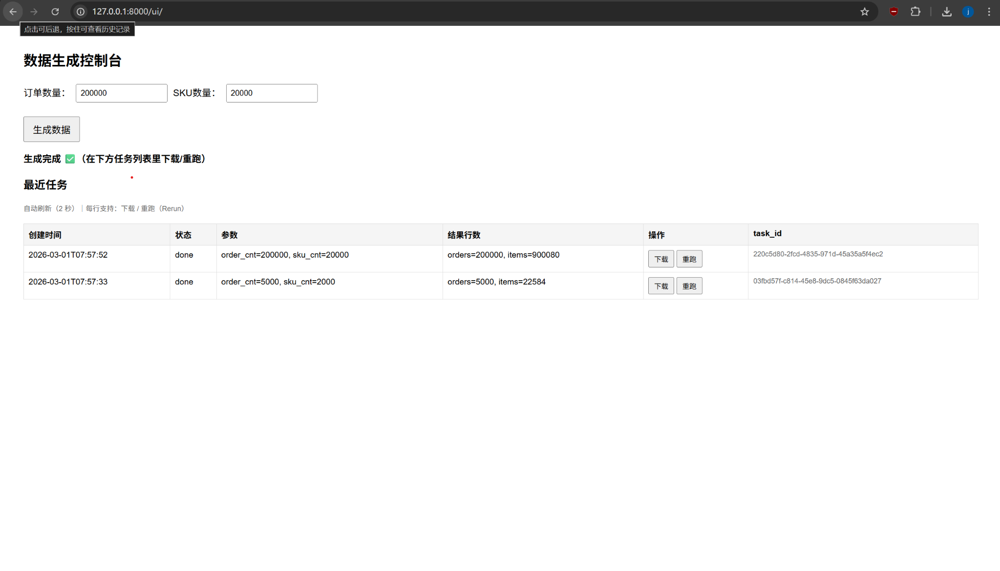
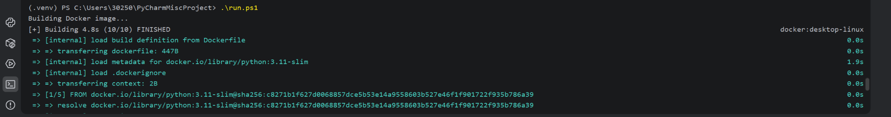
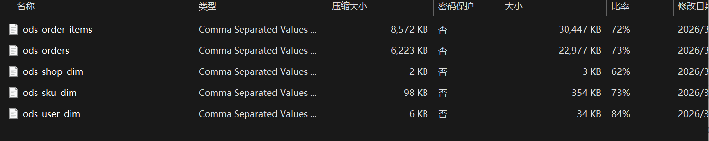
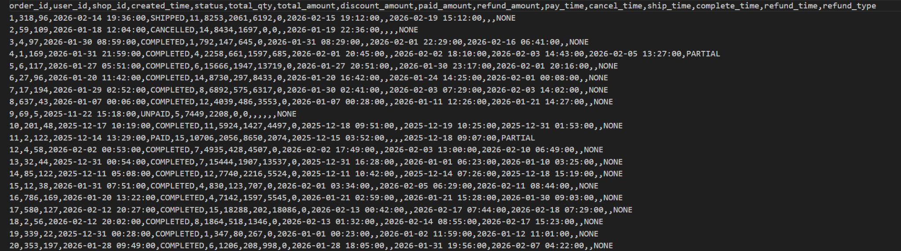
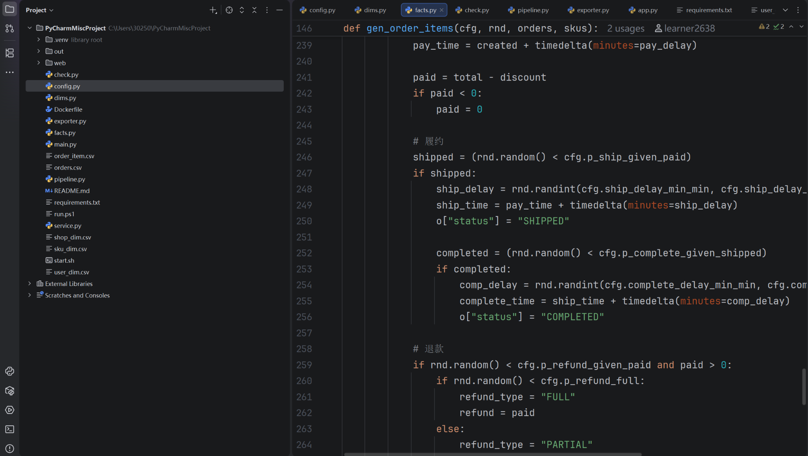

# 🚀 Synthetic E-commerce Data Simulator

A configurable **synthetic e-commerce data generation platform** designed for:

* Data Warehouse Learning
* SQL Practice
* Big Data Pipeline Experiments
* ETL Testing
* Teaching Demonstrations

This project solves a common problem in data engineering learning:

❌ Tutorials assume data already exists
✅ This platform generates realistic business data from scratch

---

## 🖥 Demo UI

Generate datasets through a Web control panel.



---

## 🌍 Public Deployment (Cloudflare Tunnel)

The service can be exposed publicly without server deployment.


---

## 🐳 Docker One-Command Run

No environment setup required.

```bash
docker build -t data-sim .
docker run -p 8000:8000 data-sim
```



---

## 📦 Generated Dataset (ODS Layer)

The platform exports ready-to-use warehouse datasets.



Exported tables:

* ods_orders
* ods_order_items
* ods_user_dim
* ods_shop_dim
* ods_sku_dim

---

## 📊 Sample Dataset Preview

Realistic order lifecycle simulation:

* UNPAID
* PAID
* SHIPPED
* COMPLETED
* CANCELLED
* REFUND (FULL / PARTIAL)



---

## 🧱 Project Architecture

```
Data Generator
      ↓
ODS Dataset Export
      ↓
Hive / MySQL / Spark
      ↓
Data Warehouse Modeling Practice
```

---

## 📁 Project Structure



Core modules:

```
web/            FastAPI service + Web UI
config.py       Simulation configuration
pipeline.py     Dataset pipeline builder
facts.py        Fact table generator
dims.py         Dimension generator
exporter.py     ODS export logic
service.py      Job execution service
```

---

## ✨ Features

* Configurable dataset scale
* Realistic order lifecycle simulation
* Refund & fulfillment workflow
* Data consistency validation
* Hive ODS export
* Web UI control panel
* Docker one-command deployment
* Reproducible data generation

---

## ⚙️ Quick Start

### Install Dependencies

```bash
pip install -r requirements.txt
```

### Run Service

```bash
uvicorn web.app:app --host 0.0.0.0 --port 8000
```

Open:

```
http://127.0.0.1:8000/ui/
```

---

## 🐳 Run With Docker

```bash
docker build -t data-sim .
docker run --rm -p 8000:8000 -v $(pwd)/out:/app/out data-sim
```

---

## 📘 Use Cases

* Data Warehouse Practice
* SQL Interview Preparation
* Big Data Learning
* ETL Pipeline Testing
* Teaching & Demo Environment

---

## 📜 License

MIT License
