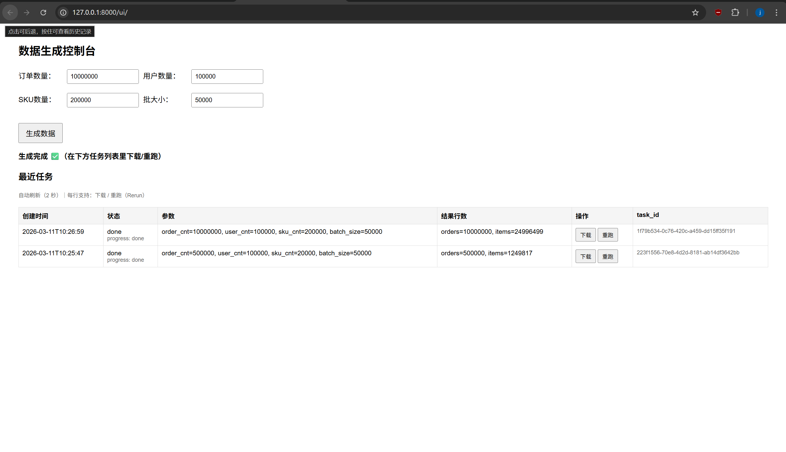
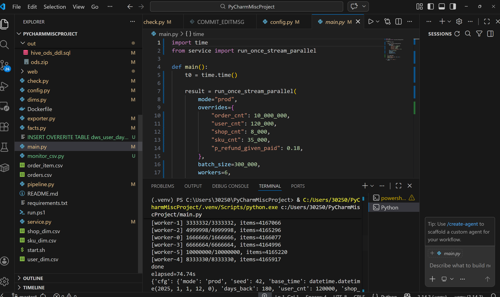
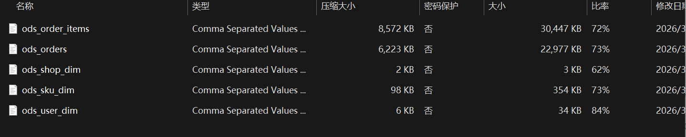
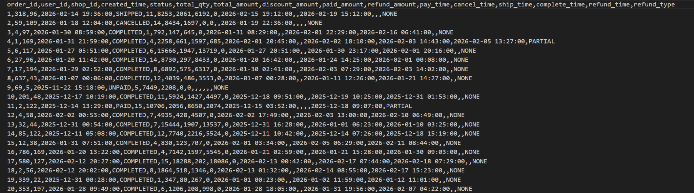
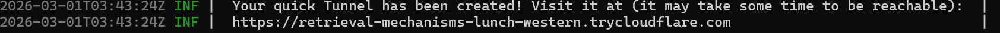
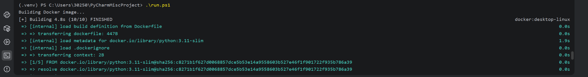

# 🚀 Synthetic E-commerce Data Simulator

A configurable **synthetic e-commerce data generation platform** designed for:

- Data Warehouse Learning
- SQL Practice
- Big Data Pipeline Experiments
- ETL Testing
- Teaching Demonstrations

This project solves a common problem in data engineering learning:

❌ Tutorials assume data already exists  
✅ This platform generates **realistic business datasets from scratch**

---

# 🖥 Demo UI

Generate datasets through a Web control panel.



Users can configure:

- order count
- user count
- SKU count
- batch size

Datasets can be generated directly from the browser.

---

# ⚡ Performance Benchmark

Example generation performance.



Example configuration:

| Parameter | Value |
|-----------|------:|
| Orders | 10,000,000 |
| Users | 120,000 |
| Shops | 8,000 |
| SKUs | 35,000 |
| Workers | 6 |

Generation result:

| Metric | Result |
|------|------:|
| Orders Generated | 10,000,000 |
| Order Items | ~25,000,000 |
| Time Elapsed | ~74 seconds |

Example worker logs:

```
[worker-1] 3333332/3333332
[worker-2] 4999998/4999998
[worker-3] 6666664/6666664
[worker-4] 8333330/8333330
[worker-5] 10000000/10000000
done
elapsed=74.74s
```
### Average Generation Speed

Based on the benchmark above:

- **10,000,000 orders generated in ~74 seconds**

Average generation speed:

```
≈ 135,000 orders / second
```

Including order items:

```
≈ 190,000 rows / second
```

This performance is achieved through **parallel streaming generation with multiple workers**, allowing large-scale datasets to be produced efficiently on a standard laptop.
Parallel generation significantly improves throughput while keeping memory usage stable.

---

# 📦 Generated Dataset (ODS Layer)

The platform exports ready-to-use warehouse datasets.



Exported tables:

- ods_orders
- ods_order_items
- ods_user_dim
- ods_shop_dim
- ods_sku_dim

These datasets can be directly used for:

- Hive learning
- Spark ETL
- SQL practice
- Data warehouse modeling

---

# 📊 Sample Dataset Preview

Realistic order lifecycle simulation.



Order lifecycle includes:

- UNPAID
- PAID
- SHIPPED
- COMPLETED
- CANCELLED
- REFUND (FULL / PARTIAL)

The simulator generates:

- multi-item orders
- payment transitions
- shipping flows
- refund scenarios
- cancellation scenarios

---

# 🌍 Public Deployment (Cloudflare Tunnel)

The service can be exposed publicly without server deployment.



Architecture:

```
Local FastAPI Service
        ↓
Cloudflare Tunnel
        ↓
Public Internet Access
```

This allows sharing the simulator with others without renting servers.

---

# 🐳 Docker One-Command Run

No environment setup required.

```bash
docker build -t data-sim .
docker run -p 8000:8000 data-sim
```



Then open:

```
http://localhost:8000/ui/
```

---

# 🧱 Project Architecture

```
Synthetic Data Generator
        ↓
ODS Dataset Export
        ↓
Hive / MySQL / Spark
        ↓
Data Warehouse Modeling Practice
```

---

# 📁 Project Structure

```
web/            FastAPI service + Web UI
config.py       Simulation configuration
pipeline.py     Dataset pipeline builder
facts.py        Fact table generator
dims.py         Dimension generator
exporter.py     ODS export logic
service.py      Job execution service
```

---

# ✨ Key Features

- Configurable dataset scale
- Realistic order lifecycle simulation
- Refund & fulfillment workflow simulation
- Data consistency validation
- Hive-ready ODS export
- Web UI control panel
- Docker one-command deployment
- Parallel dataset generation
- Reproducible data generation

---

# ⚙️ Quick Start

Install dependencies:

```bash
pip install -r requirements.txt
```

Run service:

```bash
uvicorn web.app:app --host 0.0.0.0 --port 8000
```

Open:

```
http://127.0.0.1:8000/ui/
```

---

# 🐳 Run With Docker

```bash
docker build -t data-sim .
docker run --rm -p 8000:8000 -v $(pwd)/out:/app/out data-sim
```

---

# 🧪 Example Learning Workflow

Example data engineering learning pipeline:

```
Synthetic Data Generator
        ↓
ODS Dataset
        ↓
Hive Tables
        ↓
DWD Layer
        ↓
DWS Layer
        ↓
BI Analysis
```

Students can practice:

- warehouse modeling
- ETL pipelines
- analytical SQL
- data aggregation

---

# 📘 Use Cases

This project can be used for:

- Data Warehouse Practice
- SQL Interview Preparation
- Big Data Learning
- ETL Pipeline Testing
- Teaching Demonstrations

---

# 🚧 Roadmap

Planned improvements:

- Parquet / ORC dataset export
- Kafka streaming generation
- ClickHouse dataset export
- Spark ingestion examples
- Slowly Changing Dimension simulation
- Warehouse modeling tutorials

---

# 📜 License

MIT License

---

# 👤 Author

Jack Elon
